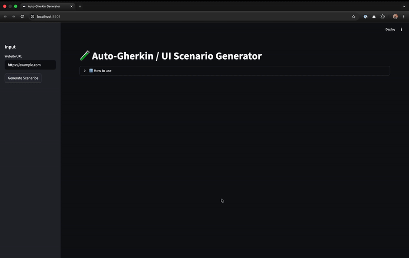

# UI Scenario Generator (FastAPI + Streamlit + CrewAI)

[](#)  [](#)

## 🔎 What is this

This project generates UI interaction scenarios (e.g. hover menus, popups, overlays) — expressed as BDD-style Gherkin feature files — from a given website URL.  
It uses:

- A **FastAPI** backend to accept job requests and run the analysis pipeline using your custom agents.  
- A **Streamlit** frontend UI for users to submit URLs, start analysis, and view or download the generated scenarios.  
- A background job + polling pattern to handle long-running analysis without blocking the UI.

This lets you quickly generate test-scenario specs for any website — useful for QA, automation, or documentation workflows.

## 🚀 Features

- Accept URL via UI and run analysis in background.  
- Display results as formatted Gherkin `.feature` text or raw output.  
- Download results for offline use.  
- Clean, user-friendly UI with sidebar layout, tabs, and status indicators. 

## Demo



## Setup

Follow the steps below to set up backend and run the tool locally:

### 1. Clone the repository

Run the following commands to clone the repository and navigate to the project folder:

   ```bash
   git clone {repository_url}
   cd {local_repository_path}
   ```

Replace <repository_url> and <repository_directory> with your actual values.

### 2. Activate Environment

Install UV in your system

```python
pip install uv
```

Activate the virtual venv

```python
source .venv/bin/activate  # For Linux/Mac
.venv\Scripts\activate     # For Windows
```

## Usage

Run the following command to start both the backend and frontend:

```bash
sh start.sh
```

This will:

• Launch the FastAPI backend at: <http://0.0.0.0:8000/docs>

• Start the React frontend at: <http://localhost:8501/>

